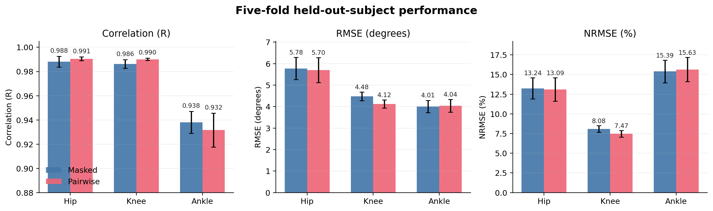
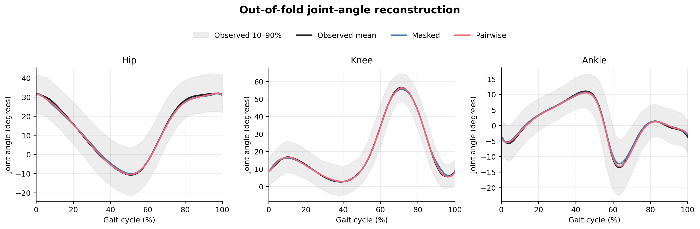
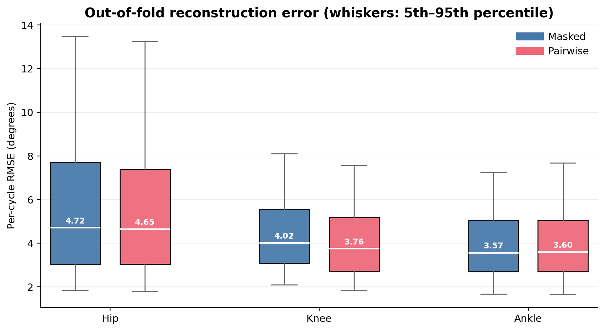

# Self-supervised joint-angle models

Self-supervised BiLSTM models for reconstructing sagittal hip, knee, and ankle
angles. The learned temporal weights can initialize the LSTM in the dual-path
model described in [the associated paper](https://arxiv.org/abs/2512.05030).

Two designs are included:

- `MaskedJointModel`: masks one joint channel and reconstructs it from the
  other two.
- `PairwiseJointModel`: three directional regressors, each predicting one joint
  from the other two.

## Setup

Python 3.12 is recommended.

```bash
python -m venv .venv
source .venv/bin/activate
pip install -r requirements.txt
```

## Prepare C3D data

`preprocess_c3d.py` reads Vicon Plug-in Gait angle outputs and foot-strike
events, creates ipsilateral gait cycles, and resamples each cycle to 101 points.

```bash
python preprocess_c3d.py \
  --data_dir /path/to/c3d_directory \
  --output joint_angles.npz \
  --side both \
  --points 101
```

The source C3D data and processed dataset are not included in this repository.

## Cross-validation training

Both scripts use subject-stratified folds. Normalization is fitted on training
subjects only and saved beside each checkpoint.

```bash
python train_masked_jnt.py \
  --data joint_angles.npz --epochs 40 --folds 5 --batch_size 64 \
  --output_dir checkpoints/masked --seed 42

python train_pairwise_jnt.py \
  --data joint_angles.npz --epochs 40 --folds 5 --batch_size 64 \
  --output_dir checkpoints/pairwise --seed 42
```

## Full-data training

After cross-validation, train deployable weights on every usable cycle:

```bash
python train_final_jnt.py \
  --data joint_angles.npz --epochs 40 --batch_size 64 \
  --output_dir checkpoints/final --seed 42 --design both
```

## Included trained models

`models/full_data/` contains weights trained on 997 gait cycles from 103
subjects, plus the required normalization parameters:

- `masked_jnt_full.pt`
- `pairwise_jnt_ch0_full.pt`: knee + ankle to hip
- `pairwise_jnt_ch1_full.pt`: hip + ankle to knee
- `pairwise_jnt_ch2_full.pt`: hip + knee to ankle
- `full_data_normalization.npz`

Five-fold held-out-subject metrics are stored as JSON in `results/`. Mean
correlations for the masked model were 0.988 hip, 0.986 knee, and 0.938 ankle;
for the pairwise models they were 0.991 hip, 0.990 knee, and 0.932 ankle.

## Results figures







Regenerate the metric summary from the checked-in JSON files:

```bash
python plot_results.py
```

To also regenerate the out-of-fold prediction figures, provide the processed
dataset and both cross-validation checkpoint directories:

```bash
python plot_results.py \
  --data joint_angles.npz \
  --masked_checkpoints checkpoints/masked \
  --pairwise_checkpoints checkpoints/pairwise
```
